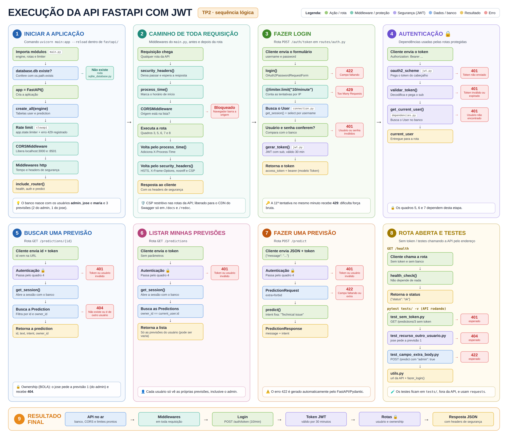

# TP2 - Análise e Segurança de Agentes de IA

**Projeto de Bloco | Instituto Infnet**

Sistema de atendimento ao cliente alimentado por inteligência artificial. Este segundo TP dá continuidade ao
TP1: completa a análise exploratória do dataset, com testes de hipótese, e transforma a API em uma API com
banco de dados e controles de segurança do OWASP Top 10, auditada por scan passivo do OWASP ZAP.

Grupo

- Alberto Frasson
- Johanna Liza
- Samuel Hermany
- Uendel Ives

---

## Objetivo do projeto

O bloco tem duas fases. Na primeira, constrói-se um sistema de atendimento ao cliente alimentado por IA; na
segunda, o sistema de um colega é atacado para identificar as falhas de segurança nele deixadas. Por isso a
segurança é tratada desde o primeiro commit, e não como camada adicionada ao final.

Este TP2 corresponde à competência integradora **"Implementar análise estatística completa e controles OWASP
Top 10 na API FastAPI auditada por ZAP"** e entrega:

1. **Análise exploratória (EDA) completa** - compreensão do problema, inspeção inicial, verificação de
   qualidade, limpeza e preparação, análise univariada, análise multivariada, identificação de outliers e
   anomalias, testes de hipótese formais e documentação das conclusões.
2. **Banco de dados SQLite** (`fastapi/database.db`) com usuários e predictions, criado e populado por
   `fastapi/sqlite_database.py`. A API consulta o banco somente via **SQLModel**.
3. **Modelos Pydantic com `extra='forbid'`** - a API rejeita campos extras com status **422**.
4. **Controle de acesso por ownership** - nas rotas por ID, a API só devolve o recurso ao seu proprietário
   (proteção contra BOLA).
5. **Headers de segurança HTTP** (HSTS, X-Frame-Options, X-Content-Type-Options e Content-Security-Policy) e
   **CORS** com allowlist explícita de origens, via middleware FastAPI.
6. **Rate limiting** com SlowAPI no endpoint `POST /auth/token`.
7. **Scan passivo com OWASP ZAP** e análise dos findings Medium e High.
8. **Testes automatizados com pytest.**

O modelo de machine learning e o agente de IA **não** fazem parte deste TP. A rota `/predict` retorna, por
ora, uma intenção fixa que simula a saída do classificador a ser implementado nos TPs seguintes.

---

## Sobre o dataset

**Customer Support Ticket Dataset** - Kaggle, publicado por Suraj (`suraj520`), licença **CC0: Public
Domain**.
🔗 https://www.kaggle.com/datasets/suraj520/customer-support-ticket-dataset

> A análise detalhada do dataset está no notebook **[eda/TP2_EDA.ipynb](eda/TP2_EDA.ipynb)** - significado
> das colunas, verificação da qualidade dos dados (valores ausentes, duplicatas, tipos), limpeza e
> preparação, análises univariada e multivariada, outliers e anomalias, testes de hipótese e conclusões.

### Principais características

|                         |                                                                                                                              |
| ----------------------- | ---------------------------------------------------------------------------------------------------------------------------- |
| **Dimensões**           | 8.469 registros × 17 atributos                                                                                               |
| **Composição**          | 2 variáveis quantitativas, 6 categóricas, 3 temporais, 5 textuais e 1 identificador                                          |
| **Variável de entrada** | `Ticket Description` - relato do cliente em texto livre                                                                      |
| **Variável-alvo**       | `Ticket Type` - 5 categorias praticamente balanceadas (razão de 1,07 entre a maior e a menor)                                |
| **Natureza**            | Dados **sintéticos** - 100% dos e-mails usam domínios reservados pela RFC 2606, decisão declarada pelo autor por privacidade |
| **Completude**          | 13 colunas 100% preenchidas; 4 colunas com ausência **estrutural** (só existem para chamados encerrados)                     |

O conjunto combina dados estruturados e textuais, permitindo investigar o perfil dos clientes, os tipos de
problema, os produtos, os canais de atendimento, as prioridades, os tempos de resposta e resolução e a
satisfação - inclusive cruzando essas dimensões.

### Motivo da escolha

- **Aderência direta ao objetivo.** O par `Ticket Description` → `Ticket Type` é exatamente o problema de
  classificação de intenção da rota `/predict`. Não há necessidade de rotular dados manualmente. Esse uso é
  **explicitamente previsto na documentação oficial**, que lista entre os casos de uso: _"NLP: the ticket
  descriptions can be used for training NLP models to automate ticket categorization"_.
- **Variável-alvo balanceada**, o que dispensa reamostragem e torna a acurácia uma métrica interpretável.
- **Riqueza para uma EDA completa**, com variáveis de todos os tipos em um único conjunto.
- **Licença CC0 e ausência de PII real**, permitindo versionar o CSV em repositório público e conduzir
  exercícios ofensivos sem risco jurídico - enquanto o dataset ainda _simula_ campos sensíveis, preservando
  o valor didático da modelagem de ameaças.
- **Campo de texto livre como superfície de ataque**, que é o vetor explorado em _prompt injection_ nos
  próximos blocos.
- **Escala adequada** (~3,8 MiB), versionável em Git e processável localmente.

---

## Instruções de instalação

### Pré-requisitos

- Python 3.10 ou superior
- `pip`
- **Somente no Windows:** liberar a execução de scripts na sessão atual do PowerShell (uma única vez)

```powershell
Set-ExecutionPolicy -Scope Process -ExecutionPolicy Bypass
```

### Passo a passo

**1. Clone o repositório e acesse a pasta da API**

```bash
git clone https://github.com/infnet26-alberto-johanna-samuel-uendel/alberto_johanna_samuel_uendel_tp2.git
cd alberto_johanna_samuel_uendel_tp2/fastapi
```

**2. Crie e ative o ambiente virtual**

```bash
python -m venv .venv
```

```powershell
# Windows (PowerShell)
.venv\Scripts\Activate.ps1
```

```bash
# Linux / macOS
source .venv/bin/activate
```

**3. Instale as dependências**

```bash
python -m pip install -r requirements.txt

# Verificação: deve exibir name, version e location do pacote
python -m pip show fastapi
```

> O `requirements.txt` já inclui o `pytest` e o `requests`, usados nos testes automatizados.
>
> As dependências do EDA (`pandas`, `matplotlib`, `seaborn`, `scipy`, `jupyter`) são instaladas à parte,
> conforme o ambiente usado para executar o notebook.

---

## Criação e população do banco de dados

O banco `fastapi/database.db` já está no repositório, pronto para uso. Para recriá-lo do zero, a partir da
pasta `fastapi/`, com o ambiente virtual ativado:

```bash
python sqlite_database.py
```

O script usa a biblioteca `sqlite3` para criar as tabelas `user` e `prediction` e inserir os dados
iniciais. Antes de criar, ele apaga as tabelas existentes, então pode ser executado quantas vezes for
necessário. Cada prediction tem um `owner_id` que identifica seu proprietário:

| Prediction | Texto                         | Proprietário |
| ---------- | ----------------------------- | ------------ |
| 1          | Meu pedido não chegou         | `admin`      |
| 2          | Quero cancelar minha compra   | `admin`      |
| 3          | Qual o prazo de entrega?      | `jose`       |

Se o arquivo `database.db` não existir quando a API for iniciada, o `main.py` executa o
`sqlite_database.py` automaticamente.

> SQL direto (`sqlite3`) é usado **somente** neste script, para criar e popular o banco. Dentro da API,
> todas as consultas são feitas com **SQLModel**.

---

## Instruções de execução

### API

A partir da pasta `fastapi/`, com o ambiente virtual ativado:

```bash
uvicorn main:app --reload
```

> A API deve ser iniciada **de dentro da pasta `fastapi/`**, pois o caminho do banco (`database.db`) é
> relativo a essa pasta.

A API sobe em **http://127.0.0.1:8000** e a documentação interativa (Swagger UI) fica em
**http://127.0.0.1:8000/docs**.

#### Endpoints

| Método | Rota                | Autenticação   | Descrição                                                           |
| ------ | ------------------- | -------------- | ------------------------------------------------------------------- |
| `GET`  | `/health`           | Pública        | Verifica se a API está ativa. Retorna `{"status": "ok"}`            |
| `POST` | `/auth/token`       | Pública        | Autentica o usuário e devolve um token JWT (validade de 30 minutos) |
| `POST` | `/predict`          | **Bearer JWT** | Recebe uma mensagem e retorna uma intenção simulada                 |
| `GET`  | `/predictions`      | **Bearer JWT** | Lista somente as predictions do usuário logado                      |
| `GET`  | `/predictions/{id}` | **Bearer JWT** | Retorna a prediction somente se ela pertencer ao usuário logado     |

#### Credenciais

Os usuários são criados pelo `sqlite_database.py` e ficam na tabela de usuários do banco:

| Usuário | Senha   |
| ------- | ------- |
| `admin` | `admin` |
| `jose`  | `1234`  |
| `maria` | `1234`  |

> ⚠️ Usuários e senhas de exemplo existem **somente para fins acadêmicos**. Não é prática aceitável fora
> deste contexto.

#### Fluxo de uso

**1. Obter o token** (`/auth/token` recebe `application/x-www-form-urlencoded`, padrão do
`OAuth2PasswordBearer`):

```bash
curl -X POST http://127.0.0.1:8000/auth/token \
  -d "username=admin&password=admin"
```

```json
{ "access_token": "eyJhbGciOiJIUzI1NiIs...", "token_type": "bearer" }
```

**2. Chamar a rota protegida** com o token no cabeçalho `Authorization`:

```bash
curl -X POST http://127.0.0.1:8000/predict \
  -H "Authorization: Bearer <TOKEN>" \
  -H "Content-Type: application/json" \
  -d "{\"message\": \"Meu produto chegou com defeito e quero devolver\"}"
```

```json
{ "message": "Meu produto chegou com defeito e quero devolver", "intent": "Technical issue" }
```

Sem token válido, a rota responde **401**.

**3. Consultar uma prediction por ID** (ownership): com o token do `jose`, `GET /predictions/3` retorna a
prediction, pois ela é dele; `GET /predictions/1` responde **404**, pois pertence ao `admin`.

> Pelo Swagger UI, use o botão **Authorize** e informe usuário e senha - o token passa a ser enviado
> automaticamente nas rotas protegidas.

#### Controles de segurança

| Controle             | Como foi implementado                                                                                                                          |
| -------------------- | ---------------------------------------------------------------------------------------------------------------------------------------------- |
| Campos extras        | Modelos Pydantic com `extra='forbid'`: campo não definido no modelo → **422**                                                                  |
| Ownership (BOLA)     | As rotas de predictions filtram pelo `owner_id` do usuário logado; o recurso de outro usuário não é retornado (**404**)                       |
| Headers de segurança | Middleware adiciona `Strict-Transport-Security`, `X-Frame-Options`, `X-Content-Type-Options` e `Content-Security-Policy` em todas as respostas. O CSP é restritivo nas rotas da API e liberado para o CDN do Swagger apenas em `/docs` e `/redoc` |
| CORS                 | Middleware `CORSMiddleware` com lista explícita de origens permitidas (sem `*`)                                                                |
| Rate limiting        | SlowAPI no `POST /auth/token`: **10 requisições por minuto por cliente** (IP); a 11ª recebe **429**                                            |

**Justificativa do limite de 10 requisições por minuto:** um usuário legítimo raramente erra a senha mais
do que algumas vezes seguidas, então 10 tentativas por minuto não atrapalham o uso normal. Já um ataque de
força bruta depende de testar muitas senhas rapidamente: sem limite, um script consegue milhares de
tentativas por minuto; com o limite, cai para no máximo 10 por minuto por cliente, o que torna o ataque
lento demais para ser viável.

### EDA

```bash
jupyter notebook eda/TP2_EDA.ipynb
```

O notebook lê o dataset a partir de `data/customer_support_tickets.csv`.

---

## Execução dos testes

Os testes chamam a API pelo endereço `http://127.0.0.1:8000`, então **a API precisa estar rodando** antes
de executá-los. São usados dois terminais.

**Terminal 1 - subir a API** (dentro da pasta `fastapi/`):

```powershell
cd fastapi
.venv\Scripts\Activate.ps1
uvicorn main:app --reload
```

**Terminal 2 - rodar os testes** (na **raiz** do projeto, usando o mesmo ambiente virtual):

```powershell
fastapi\.venv\Scripts\Activate.ps1
python -m pytest tests/ -v
```

> No Linux / macOS, a ativação é `source fastapi/.venv/bin/activate`.

Os testes cobrem:

| Arquivo                               | Teste                             | Resultado esperado                       |
| ------------------------------------- | --------------------------------- | ---------------------------------------- |
| `tests/test_sem_token.py`             | Acesso a rota protegida sem token | **401**                                  |
| `tests/test_recurso_outro_usuario.py` | Acesso a recurso de outro usuário | **404**, o recurso **não** é retornado   |
| `tests/test_campo_extra_body.py`      | Envio de campo extra no body      | **422**                                  |

> Cada execução faz 2 logins. Executar os testes mais de 5 vezes no mesmo minuto ultrapassa o rate limit de
> `/auth/token` (10 por minuto) e o login passa a responder **429**. Nesse caso, basta aguardar 1 minuto.

---

## Scan passivo OWASP ZAP

O relatório exportado pelo OWASP ZAP após o scan passivo da API está na pasta `zap/`. A análise de cada
finding Medium e High (o que foi detectado, por que é um problema, correção realizada, validação ou risco
aceito) está em **[zap/scan_passivo_zap.md](zap/scan_passivo_zap.md)**.

---

## Estrutura de pastas

```
TP2/
├── README.md                          # Este arquivo
│
├── data/
│   └── customer_support_tickets.csv   # Customer Support Ticket Dataset (8.469 × 17)
│
├── docs/
│   ├── fluxo_api_tp2.png              # Diagrama do fluxo da API
│   └── endpoints.png                  # swagger com todos os endpoints
│
├── eda/
│   └── TP2_EDA.ipynb                  # Análise exploratória completa
│
├── fastapi/                           # Aplicação FastAPI
│   ├── main.py                        # Ponto de entrada; middlewares, rate limit e routers
│   ├── database.db                    # Banco SQLite com usuários e predictions
│   ├── sqlite_database.py             # Criação e população inicial do banco (sqlite3)
│   ├── requirements.txt               # Dependências da API e dos testes
│   ├── README.md                      # Instruções específicas da API
│   │
│   ├── database/
│   │   └── connection.py              # Engine SQLModel e sessão com o banco (get_session)
│   │
│   ├── models/                        # Modelos Pydantic (extra='forbid') e tabelas SQLModel
│   │   ├── auth_models.py             # Token
│   │   ├── prediction_request_model.py   # PredictionRequest (extra='forbid')
│   │   ├── prediction_response_model.py  # PredictionResponse
│   │   ├── prediction_sql_model.py    # Tabela prediction (com owner_id)
│   │   └── user_sql_model.py          # Tabela user
│   │
│   ├── routes/                        # Definição das rotas/endpoints
│   │   ├── health.py                  # GET  /health
│   │   ├── auth.py                    # POST /auth/token (rate limit)
│   │   └── predict.py                 # POST /predict, GET /predictions e GET /predictions/{id}
│   │
│   └── security/                      # Segurança e autenticação
│       ├── jwt.py                     # Geração e validação do JWT, OAuth2PasswordBearer
│       └── dependencies.py            # get_current_user (busca o usuário logado no banco)
│
├── tests/                             # Testes automatizados (pytest)
│   ├── utils.py                       # URL da API e função de login usadas pelos testes
│   ├── test_sem_token.py              # Acesso sem token → 401
│   ├── test_recurso_outro_usuario.py  # Recurso de outro usuário → 404
│   └── test_campo_extra_body.py       # Campo extra no body → 422
│
└── zap/
    ├── relatorio_zap.html             # Relatório exportado pelo OWASP ZAP
    └── scan_passivo_zap.md            # Análise dos findings Medium e High

```

---

## Responsabilidades e dependências

| Módulo      | Responsabilidade                                                                     | Depende de           |
| ----------- | ------------------------------------------------------------------------------------ | -------------------- |
| `main.py`   | Cria o app FastAPI, registra os routers, os middlewares de segurança e o rate limit  | `routes`, `database`             |
| `routes/`   | Define os endpoints. Não tem lógica de segurança, só chama as funções de `security`  | `models`, `security`, `database` |
| `models/`   | Modelos Pydantic que validam a entrada e a saída e tabelas SQLModel do banco         | nenhum                           |
| `security/` | Geração e validação do JWT, `OAuth2PasswordBearer` e identificação do usuário logado | `models`, `database`             |
| `database/` | Conexão com o banco SQLite via SQLModel                                              | nenhum                           |

Fluxo: `main.py` → `routes/*` → (`models/*` para validar dados) + (`security/jwt.py` e
`security/dependencies.py` para autenticar) + (`database/connection.py` para acessar o banco).
`models` e `security` nunca importam `routes`, para evitar dependência circular.

O diagrama abaixo mostra o caminho de cada requisição pela API:



---

## Referências

- Dataset: https://www.kaggle.com/datasets/suraj520/customer-support-ticket-dataset
- Documentação FastAPI: https://fastapi.tiangolo.com
- RFC 7519 - _JSON Web Token (JWT)_: https://www.rfc-editor.org/rfc/rfc7519
- SQLModel: https://sqlmodel.tiangolo.com
- SlowAPI: https://slowapi.readthedocs.io
- OWASP Top 10: https://owasp.org/www-project-top-ten/
- OWASP ZAP: https://www.zaproxy.org
